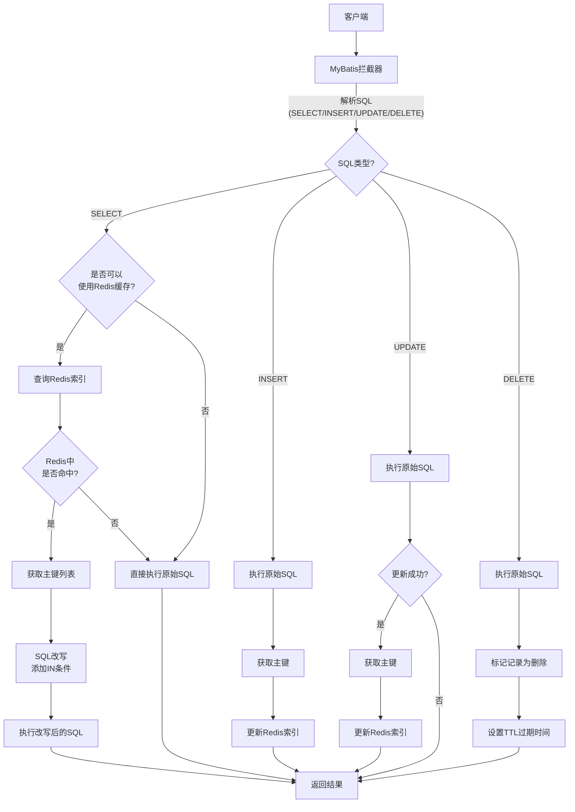
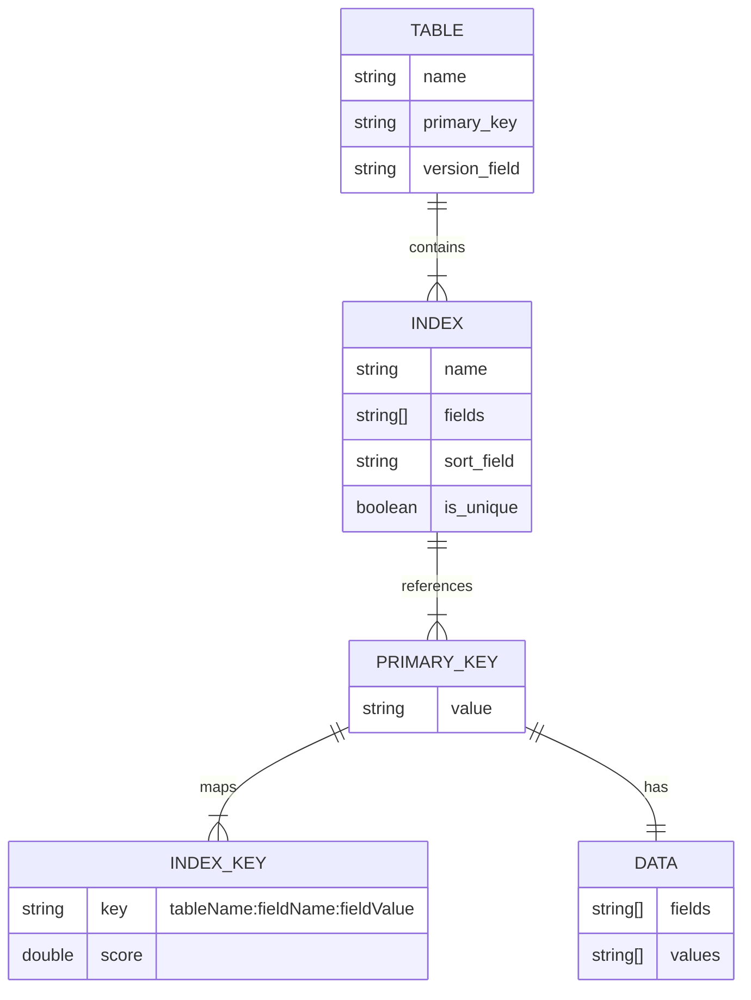

# RedisJQL

[](LICENSE)
[](https://www.oracle.com/java/technologies/javase-downloads.html)
[](https://spring.io/projects/spring-boot)
[](https://mybatis.org/mybatis-3/)
[](https://redis.io/)

RedisJQL是一个结合MyBatis和Redis的高性能SQL索引解决方案，通过拦截SQL查询并使用Redis索引加速数据库访问，显著提升应用性能。

## 功能特点

- **SQL拦截和改写**：自动拦截和改写SQL查询，无需修改现有代码
- **多级缓存策略**：支持Redis和本地Caffeine缓存，灵活配置
- **多Redis客户端**：支持Jedis和Lettuce（响应式）两种Redis客户端
- **自动索引管理**：自动维护索引字段与主键之间的映射关系
- **透明集成**：与MyBatis和Spring Boot无缝集成
- **索引配置灵活**：支持多种索引配置方式
- **乐观锁支持**：内置版本字段管理，支持乐观锁机制

## 架构图

```
┌───────────────────────────────────────────────────────────────┐
│                       应用层                                   │
└───────────────────────────────────────────────────────────────┘
                           │
                           ▼
┌───────────────────────────────────────────────────────────────┐
│                     MyBatis 层                                │
│  ┌────────────────────────────────────────────────────────┐   │
│  │              RedisJqlInterceptor                       │   │
│  └────────────────────────────────────────────────────────┘   │
└───────────────────────────────────────────────────────────────┘
                    │                 │
          ┌─────────┘                 └─────────┐
          ▼                                     ▼
┌─────────────────────┐             ┌─────────────────────────┐
│   SQL解析 & 改写     │             │    缓存操作服务         │
│                     │             │                         │
│  ┌───────────────┐  │             │  ┌─────────────────────┐│
│  │ SelectParser  │  │             │  │CacheOperationService││
│  └───────────────┘  │             │  └─────────────────────┘│
│  ┌───────────────┐  │             │          ┌┬┬┐           │
│  │ InsertParser  │  │             │          ├┼┼┤           │
│  └───────────────┘  │             │          ├┼┼┤           │
│  ┌───────────────┐  │             │          └┴┴┘           │
│  │ UpdateParser  │  │             │          ┌───┐          │
│  └───────────────┘  │             │          │ R │          │
│  ┌───────────────┐  │             │          │ e │          │
│  │ DeleteParser  │  │             │          │ d │          │
│  └───────────────┘  │             │          │ i │          │
└─────────────────────┘             │          │ s │          │
                                    │          └───┘          │
                                    └─────────────────────────┘
                                              │
                                              ▼
                          ┌─────────────────────────────────┐
                          │           数据库                │
                          └─────────────────────────────────┘
```

## 工作流程



## 快速开始

### 添加依赖

**Maven**
```xml
<dependency>
    <groupId>org.sqlfans</groupId>
    <artifactId>redisjql-springboot</artifactId>
    <version>1.0.0</version>
</dependency>
```

**Gradle**
```gradle
implementation 'org.sqlfans:redisjql-springboot:1.0.0'
```

### 配置

在 `application.yml` 或 `application.properties` 中添加配置：

```yaml
redisjql:
  base-package: com.example.dao  # 指定扫描IndexConfig注解的基础包
  cache:
    type: redis                  # 缓存类型: redis 或 local
    redis-client: jedis          # Redis客户端: jedis 或 lettuce
  redis:
    host: localhost              # Redis服务器地址
    port: 6379                   # Redis服务器端口
    password:                    # Redis密码(可选)
    database: 0                  # Redis数据库索引
    timeout: 2000                # 连接超时时间(毫秒)
    pool:
      max-total: 8               # 连接池最大连接数
      max-idle: 8                # 最大空闲连接数
      min-idle: 0                # 最小空闲连接数
```

### 定义索引配置

创建索引配置类：

```java
import org.sqlfans.redisjql.annotation.Index;
import org.sqlfans.redisjql.config.IndexConfig;

@Index
public class UserTableIndex extends IndexConfig {
    
    public UserTableIndex() {
        setTableName("t_user");           // 设置表名
        setPrimaryKey("id");              // 设置主键
        setVersionField("jpa_version");   // 设置版本字段名(乐观锁)
        
        // 添加普通索引
        IndexDefinition nameIndex = new IndexDefinition();
        nameIndex.setName("name_idx");
        nameIndex.addField("name");
        nameIndex.setSortField("create_time");
        addIndex(nameIndex);
        
        // 添加复合索引
        IndexDefinition statusTimeIndex = new IndexDefinition();
        statusTimeIndex.setName("status_time_idx");
        statusTimeIndex.addField("status");
        statusTimeIndex.addField("create_time");
        statusTimeIndex.setSortField("create_time");
        statusTimeIndex.setUnique(false);
        addIndex(statusTimeIndex);
        
        // 添加唯一索引
        IndexDefinition emailIndex = new IndexDefinition();
        emailIndex.setName("email_idx");
        emailIndex.addField("email");
        emailIndex.setUnique(true);
        addIndex(emailIndex);
    }
}
```

### 注册MyBatis拦截器

```java
import org.apache.ibatis.plugin.Interceptor;
import org.mybatis.spring.SqlSessionFactoryBean;
import org.springframework.context.annotation.Bean;
import org.springframework.context.annotation.Configuration;
import org.sqlfans.redisjql.interceptor.RedisJqlInterceptor;
import org.sqlfans.redisjql.parser.StatementParser;
import org.sqlfans.redisjql.cache.CacheOperationService;

@Configuration
public class MyBatisConfig {
    
    @Bean
    public SqlSessionFactoryBean sqlSessionFactory(DataSource dataSource, 
                                                 RedisJqlInterceptor redisJqlInterceptor) {
        SqlSessionFactoryBean sqlSessionFactory = new SqlSessionFactoryBean();
        sqlSessionFactory.setDataSource(dataSource);
        sqlSessionFactory.setPlugins(new Interceptor[]{redisJqlInterceptor});
        return sqlSessionFactory;
    }
    
    @Bean
    public RedisJqlInterceptor redisJqlInterceptor(StatementParser statementParser, 
                                                 CacheOperationService cacheOperationService) {
        return new RedisJqlInterceptor(statementParser, cacheOperationService);
    }
}
```

完成上述配置后，RedisJQL将自动拦截和处理MyBatis执行的SQL查询，无需修改DAO层代码。

## 核心API

### CacheOperationService接口

缓存操作的核心接口，定义了与缓存交互的方法：

```java
public interface CacheOperationService {
    // 添加索引记录
    void addIndexRecord(String indexKey, String primaryKey, double score);
    
    // 添加主键到索引的映射
    void addPrimaryKeyToIndexMapping(String tableName, String primaryKey, String indexKey);
    
    // 根据索引键查询主键列表
    Set<String> queryPrimaryKeysByIndex(String indexKey, long start, long end);
    
    // 标记删除记录
    void markForDeletion(String tableName, String primaryKey);
    
    // 清理标记为删除的记录
    void cleanupMarkedRecords();
    
    // 移除索引记录
    void removeIndexRecord(String indexKey, String primaryKey);
    
    // 获取主键对应的索引键集合
    Set<String> getPrimaryKeyMappings(String tableName, String primaryKey);
    
    // 添加数据字段
    void addDataField(String dataKey, String fieldName, String fieldValue);
    
    // 获取指定数据键的字段值
    String getFieldValue(String dataKey, String fieldName);
    
    // 获取匹配模式的所有键
    Set<String> getAllKeys(String pattern);
}
```

### 索引配置

```java
public class IndexConfig {
    private String tableName;          // 表名
    private String primaryKey;         // 主键字段
    private String versionField;       // 版本字段(乐观锁)
    private List<IndexDefinition> indexes = new ArrayList<>(); // 索引定义列表
    
    // 索引定义类
    public static class IndexDefinition {
        private String name;           // 索引名
        private List<String> fields;   // 索引字段
        private String sortField;      // 排序字段
        private boolean isUnique;      // 是否唯一索引
        // 省略getter和setter
    }
    
    // 省略getter和setter
}
```

## 支持的SQL操作

RedisJQL支持所有标准SQL操作，并对以下操作进行特殊处理：

1. **SELECT**：
   - 如果WHERE条件包含索引字段，将通过Redis加速查询
   - 支持ORDER BY、LIMIT等子句
   - 针对IN查询进行优化

2. **INSERT**：
   - 自动维护Redis索引
   - 支持乐观锁版本管理

3. **UPDATE**：
   - 自动更新受影响记录的索引
   - 支持乐观锁并发控制

4. **DELETE**：
   - 自动标记并清理Redis中的记录
   - 延迟删除机制避免缓存不一致

## 索引数据结构



RedisJQL使用多种Redis数据结构存储和管理索引：

1. **索引记录** (Sorted Set): `tableName:fieldName:fieldValue` → 主键值集合
2. **主键映射** (Set): `tableName:primaryKey:mappings` → 索引键集合
3. **数据字段** (Hash): `tableName:data:primaryKey` → 字段值映射

## 性能优化

- **批量操作**：使用pipeline减少Redis网络往返
- **延迟删除**：通过TTL机制处理删除操作
- **本地缓存**：提供Caffeine作为本地缓存选项
- **SQL改写**：通过IN条件优化数据库查询

## 配置选项

| 配置项 | 描述 | 默认值 |
|-------|------|-------|
| `redisjql.base-package` | 扫描IndexConfig的基础包 | - |
| `redisjql.cache.type` | 缓存类型 (redis/local) | redis |
| `redisjql.cache.redis-client` | Redis客户端 (jedis/lettuce) | jedis |
| `redisjql.redis.host` | Redis服务器地址 | localhost |
| `redisjql.redis.port` | Redis服务器端口 | 6379 |
| `redisjql.redis.password` | Redis密码 | - |
| `redisjql.redis.database` | Redis数据库索引 | 0 |
| `redisjql.redis.timeout` | 连接超时(毫秒) | 2000 |
| `redisjql.redis.pool.max-total` | 最大连接数 | 8 |
| `redisjql.redis.pool.max-idle` | 最大空闲连接 | 8 |
| `redisjql.redis.pool.min-idle` | 最小空闲连接 | 0 |

## 高级用法

### 自定义缓存实现

实现`CacheOperationService`接口，并注册为Spring Bean：

```java
@Component
public class CustomCacheService implements CacheOperationService {
    // 实现接口方法
}
```

### 禁用特定查询的缓存

在SQL注释中添加特定标记，可以禁用特定查询的缓存：

```java
@Select("/* NOCACHE */ SELECT * FROM t_user WHERE id = #{id}")
User getUserById(Long id);
```

## 最佳实践

1. **合理设计索引**：只为频繁查询的字段创建索引
2. **使用乐观锁**：为表添加版本字段，确保数据一致性
3. **监控缓存命中率**：定期检查缓存效率
4. **平衡本地和Redis缓存**：根据数据变化频率选择适当缓存类型
5. **定期清理过期索引**：设置合理的过期策略

## 贡献指南

1. Fork 项目
2. 创建功能分支 (`git checkout -b feature/amazing-feature`)
3. 提交变更 (`git commit -m 'Add some amazing feature'`)
4. 推送分支 (`git push origin feature/amazing-feature`)
5. 创建Pull Request

## 许可证

MIT License