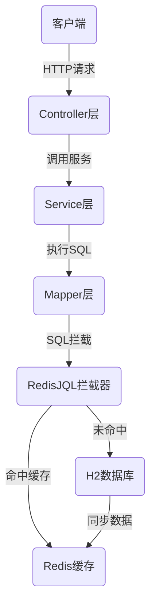
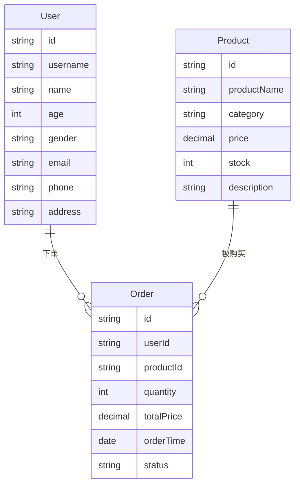

# RedisJQL 示例应用

本项目是 RedisJQL 组件的使用示例，展示了在实际业务场景中如何使用 RedisJQL 提升查询性能。

## 项目架构

示例应用采用 Spring Boot 架构，使用 MyBatis 作为 ORM 框架，H2 内存数据库作为数据源，Redis 作为缓存存储。

### 技术栈

- Spring Boot 2.7.7
- MyBatis 2.2.2
- H2 Database (内存模式)
- Redis (Lettuce)
- RedisJQL

### 系统架构图

## 业务模型

示例应用包含三个核心业务模型：

1. **用户(User)**: 用户基本信息
2. **商品(Product)**: 商品信息，包含名称、分类、价格、库存等
3. **订单(Order)**: 用户购买商品的订单记录

### 数据模型

## RedisJQL 配置与使用

本示例应用展示了 RedisJQL 在以下场景中的应用：

1. **按姓名查询用户**: 使用索引 `idx_user_name`
2. **按分类查询商品**: 使用索引 `idx_product_category`
3. **按价格排序查询商品**: 使用索引 `idx_product_price`
4. **查询用户订单**: 使用索引 `idx_order_user_id`
5. **查询商品购买记录**: 使用索引 `idx_order_product_id`

### 索引配置

索引配置位于 `redisjql-index-config.json` 文件中，包含了各表的主键、索引字段等信息。

## 性能测试

示例应用提供了一系列性能测试接口，用于展示 RedisJQL 相比传统 SQL 查询的性能优势：

- 用户名称查询性能测试: `/api/demo/user-name-search`
- 商品分类查询性能测试: `/api/demo/product-category-search`
- 商品价格排序性能测试: `/api/demo/product-price-sort`
- 用户订单查询性能测试: `/api/demo/user-order-search`
- 商品价格范围查询性能测试: `/api/demo/product-price-range`

## 快速开始

### 环境要求

- JDK 8 或以上
- Maven 3.6 或以上
- Redis 服务器 (本地 localhost:6379)

### 启动步骤

1. 克隆项目代码
2. 确保本地 Redis 服务已启动
3. 使用 Maven 构建项目: `mvn clean package`
4. 运行应用: `java -jar target/redisjql-example-1.0.0.jar`
5. 访问应用: `http://localhost:8080`

### API 文档

启动应用后，可以通过以下 URL 访问主要 API:

- 系统信息: `http://localhost:8080/`
- 用户 API: `http://localhost:8080/api/users`
- 商品 API: `http://localhost:8080/api/products`
- 订单 API: `http://localhost:8080/api/orders`
- 性能测试: `http://localhost:8080/api/demo`
- H2 控制台: `http://localhost:8080/h2-console`

## 注意事项

1. 示例应用默认使用内存 H2 数据库，应用重启后数据会重置
2. Redis 缓存需要手动清理，或者等待过期
3. 确保 Redis 服务正常运行，否则可能影响应用性能

## 许可证

本示例项目使用 MIT 许可证 